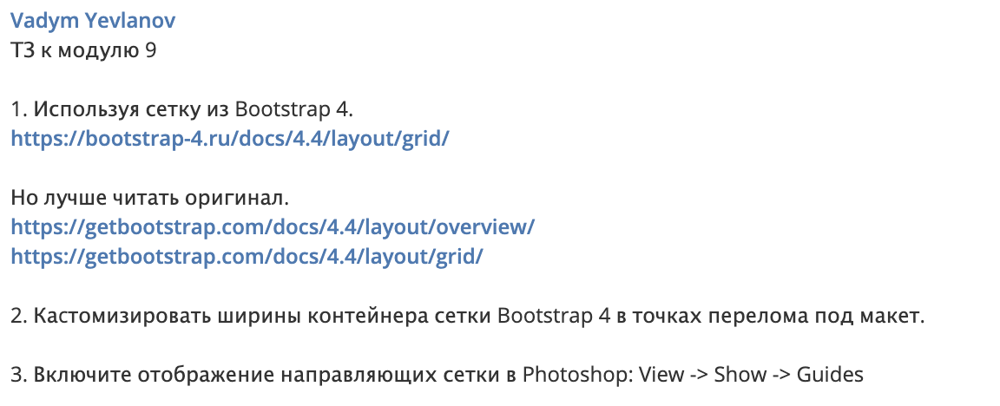

<h1>Homework 9</h1>

I made <a href="https://artemdev.github.io/homework9/index.html">adaptive website</a> using bootstrap and mobile first approach

<h3>Mobile</h3>

<h3>Tablet</h3>

<h3>Desktop</h3>

Also <a href="https://artemdev.github.io/homework9/extra-task-grid-slider.html">grid version</a> of the slider has been done

<h2>Requirements<h2>

